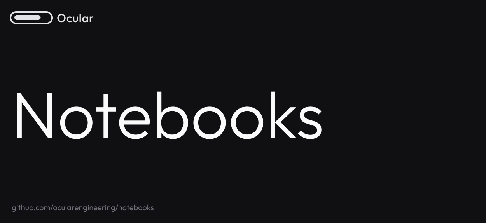

  

    
  

   

   
  

    
    
    
    
  

## Ocular AI: Data Engine for The Multimodal AI Era

This repository offers a comprehensive and continuously expanding collection of tutorials, designed to help you master the latest advancements in the field. Learn how to harness powerful state-of-the-art models like YOLOv11 for real-time object detection, SAM 2 for image segmentation, Florence-2 for visual reasoning tasks, PaliGemma 2 for multimodal learning, and Qwen2.5-VL for video-language tasks. These tutorials cover a wide range of applications, including object detection, image and video segmentation, pose estimation, data extraction, and optical character recognition (OCR).

We are committed to keeping this repository up to date, and we'll be adding new notebooks regularly to cover emerging techniques and use cases. Additionally, we welcome contributions from the community, so feel free to submit your own tutorials, improvements, or ideas to help us grow this resource.

